# DSAI 456 — Speech Recognition  
## Explanation-Only Notes for Lectures 1–8

**Purpose:** This Markdown file contains only the lecture-by-lecture explanation part. It intentionally excludes the full formula cheat sheet, past exams, original practice questions, DOCX styling instructions, and survival checklist from the bigger prompt. Use it side by side with the lecture slides: keep the slides open for figures and visual intuition, and keep this file open for the spoken-style explanation of what each slide is trying to teach.

---

## How to Use This File

Read each lecture in this order:

1. Start with the **Big Picture** to know why the lecture matters.
2. Read the **Concept Walkthrough** slowly. This is the actual explanation.
3. Use the **Mini Examples** only to check that the formula or method is not abstract.
4. Pay special attention to **Exam Traps**. Most mistakes in this course come from confusing similar concepts, not from forgetting definitions.
5. Finish each lecture with **Connections** so the course feels like one pipeline instead of eight disconnected topics.

The course logic is:

```text
Speech waveform
→ digital signal
→ short-time frames
→ frequency spectrum
→ Mel spectrum / MFCC
→ Gaussian / GMM acoustic modeling
→ HMM sequence modeling
→ Forward likelihood evaluation
→ Viterbi decoding
→ modern neural audio compression/tokenization with EnCodec
```

---

# Lecture 1 — Speech Sounds, Signal Representation, and the First Bridge to Mel

## Big Picture

Lecture 1 builds the foundation for everything else. Before building a speech recognizer, you must understand what speech physically is, how it is represented digitally, and what kinds of information can be extracted from a waveform. The lecture moves from linguistic units such as phones and syllables to signal units such as amplitude, frequency, pitch, intensity, RMS, and spectrum. This matters because speech recognition is not magic: the machine only sees numbers. The goal is to convert air pressure changes into useful numeric features that preserve the information needed to recognize phones, words, or speakers.

A weak way to study this lecture is to memorize terms. A better way is to ask: **what information does this concept preserve, and why would an ASR system care about it?**

---

## 1. Speech Sounds and Phonetic Transcription

<p align="center">
  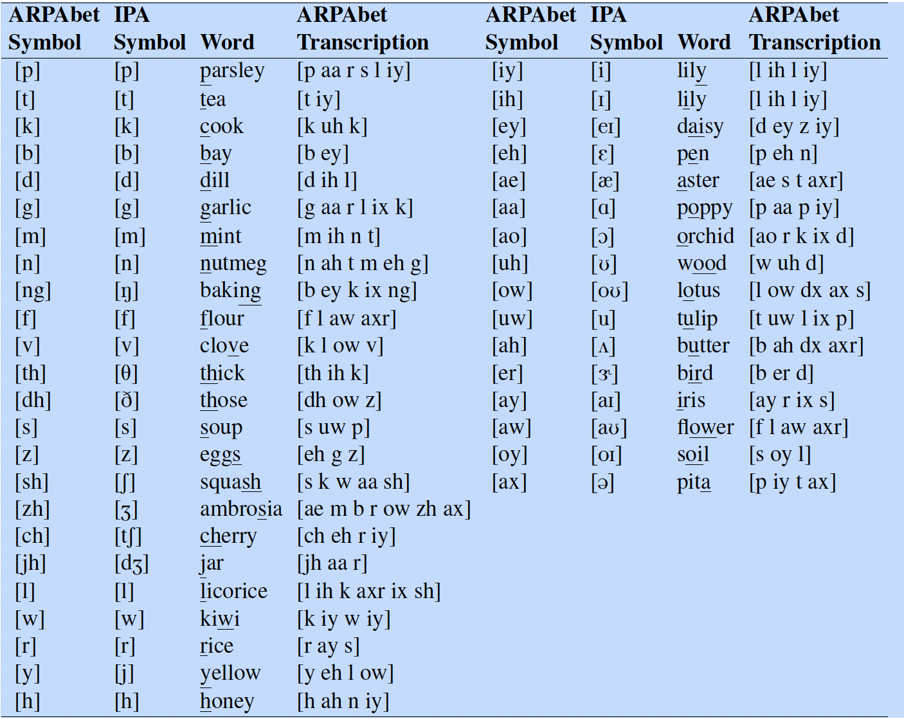
</p>


Speech is not naturally stored as written letters. Written English is an orthographic system, but pronunciation is a sound system. The same letter can map to different sounds: for example, **c** can sound like /k/ in *cat* or /s/ in *city*. This is why speech recognition often thinks in terms of **phones**, not letters.

> **DEFINITION — Phone**  
> A phone is a basic speech sound. It is a physical pronunciation unit, not necessarily a written letter.

> **DEFINITION — Phonetic Transcription**  
> Phonetic transcription represents pronunciation as a sequence of phones using a special alphabet such as the International Phonetic Alphabet.

The core idea is that speech recognition tries to infer linguistic content from acoustic evidence. The acoustic signal does not directly say “letter C”; it contains pressure patterns that may correspond to a /k/ sound, /s/ sound, vowel, stop, fricative, or another phone.

### Why This Matters

The machine receives a waveform, not a sentence. A waveform must be interpreted as a sequence of sound events. Those sound events may then map to phones, and phones may map to words. If you confuse letters with sounds, you will misunderstand why ASR is difficult. English spelling is inconsistent, but the audio signal is about pronunciation.

### Time-Aligned Transcription

<p align="center">
  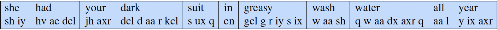
</p>


A time-aligned transcription maps parts of a waveform to the phones occurring at those times. The TIMIT corpus is a classic example: it aligns waveform segments with phone labels. This is useful because it tells us where each sound starts and ends, allowing researchers to train or evaluate acoustic models.

> **EXAM TRAP**  
> Do not say that phonetic transcription maps “letters to letters.” It maps pronunciation sounds to symbols. Also, do not assume one written character equals one phone.

---

## 2. Articulatory Phonetics: Vowels and Consonants

<p align="center">
  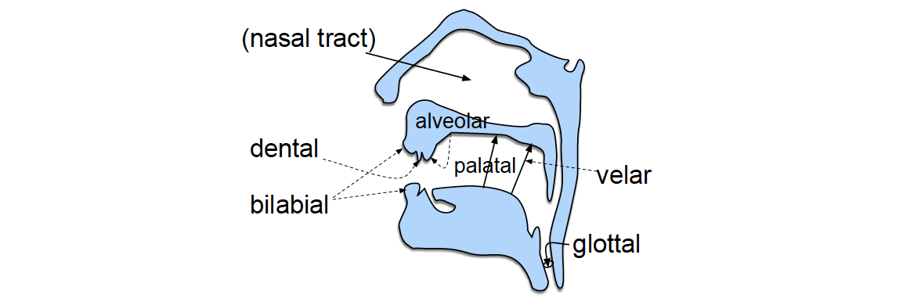
</p>
<p align="center">
  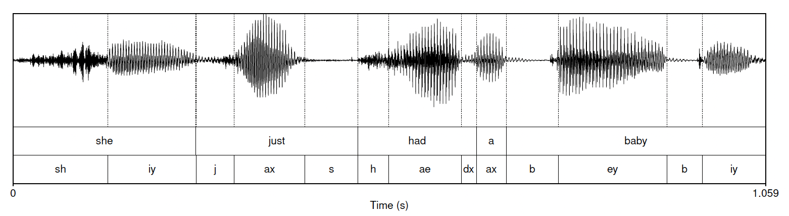
</p>


Speech sounds are produced by airflow and the vocal tract. Air passes through the glottis, and the shape of the mouth, tongue, lips, and vocal tract modifies that airflow. This creates different sounds.

Vowels are usually voiced, louder, and more periodic. They often show regular amplitude patterns because the vocal folds vibrate regularly. Consonants are more diverse. A stop consonant has closure followed by release, so it can appear as silence followed by a burst. A fricative is produced by turbulent airflow through a narrow constriction, so it looks noisier in the waveform.

> **DEFINITION — Vowel**  
> A vowel is a speech sound produced with relatively open airflow through the vocal tract. Vowels are often voiced and have strong formant structure.

> **DEFINITION — Stop Consonant**  
> A stop consonant involves blocking airflow briefly, then releasing it. In a waveform, this may appear as a silent closure followed by a burst.

> **DEFINITION — Fricative**  
> A fricative is produced by forcing air through a narrow channel, causing noisy turbulent sound.

### Why Vowels Are Easier to Spot

Vowels tend to be long, loud, voiced, and periodic. That gives them strong visible structure in the waveform and spectrum. Consonants can be short, weak, noisy, or silence-like, so they are harder to locate from waveform alone.

### Exam-Level Interpretation

If you are given a waveform and asked which region might be a vowel, look for:

- high amplitude,
- periodic cycles,
- longer duration,
- repeated peaks.

If asked which region might be a stop consonant, look for:

- a low-energy or silent closure,
- followed by sudden burst energy.

If asked which region might be a fricative, look for:

- noisy, irregular, high-frequency energy.

---

## 3. Syllables

<p align="center">
  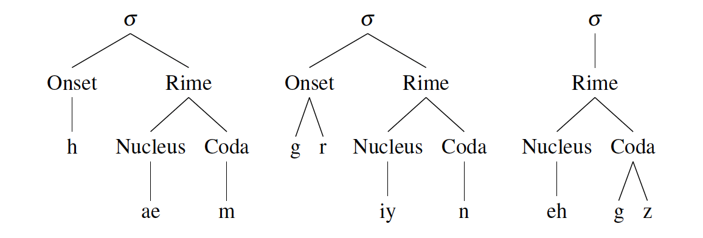
</p>


A syllable is not just “a chunk of a word.” It has internal structure. The vowel-like center is the **nucleus**. Consonants before the nucleus are the **onset**. Consonants after the nucleus are the **coda**. The nucleus plus coda is the **rime**.

For example, in a one-syllable word like *dog*, the vowel is the nucleus, /d/ is onset, and /g/ is coda. In *catnip*, there are two syllables.

> **DEFINITION — Syllable**  
> A syllable is a vowel-like sound together with surrounding consonants that are closely associated with it.

> **DEFINITION — Nucleus, Onset, Coda, Rime**  
> The nucleus is the core vowel-like part. The onset comes before the nucleus. The coda comes after the nucleus. The rime is nucleus plus coda.

### Why This Matters for ASR

Speech is sequential and structured. Phones group into syllables, syllables group into words, and words group into utterances. HMMs later model sequence structure. Lecture 1 is already hinting that speech is not a bag of independent sounds.

---

## 4. Signal Representation: Waveform, Amplitude, Frequency, and Period

<p align="center">
  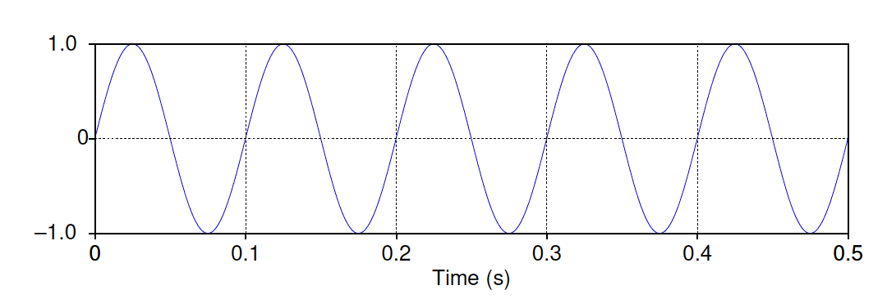
</p>
<p align="center">
  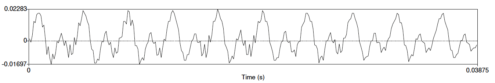
</p>


A speech signal is a waveform: a changing air pressure pattern over time. The vertical axis represents pressure variation above and below normal atmospheric pressure. The horizontal axis represents time.

A simple sine wave can be written as:

```text
y(t) = A · sin(2πft)
```

where:

- `A` is amplitude,
- `f` is frequency in Hertz,
- `t` is time,
- `T = 1/f` is the period.

> **DEFINITION — Amplitude**  
> Amplitude is the maximum displacement of the wave from its central/resting level. In speech, it relates to pressure variation and perceived loudness.

> **DEFINITION — Frequency**  
> Frequency is the number of cycles per second. Its unit is Hertz (Hz).

> **DEFINITION — Period**  
> Period is the time required for one full cycle. It is the reciprocal of frequency: `T = 1/f`.

### Mini Example

If a wave has frequency `f = 200 Hz`, then:

```text
T = 1/f
T = 1/200
T = 0.005 seconds
T = 5 ms
```

So one full cycle lasts 5 milliseconds.

### Why Speech Is More Complex Than One Sine Wave

Real speech is not a pure sine wave. It is a combination of many sinusoidal components with different frequencies and amplitudes. This is why the frequency spectrum becomes important: it tells us which frequency components are present in the waveform.

> **EXAM TRAP**  
> Do not treat speech as a single sine wave. The sine equation is a building block. Real speech is a complex mixture of many components.

---

## 5. Analog-to-Digital Conversion

<p align="center">
  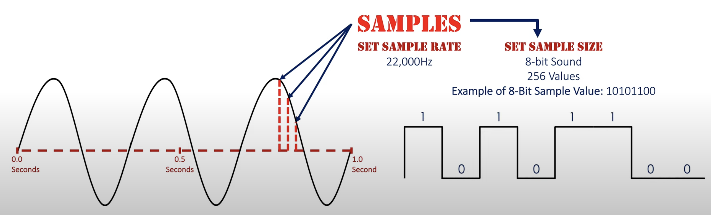
</p>


Speech begins as an analog pressure wave. A computer cannot store continuous pressure changes directly, so the signal must be sampled and digitized.

### Sampling

Sampling measures the waveform at discrete time intervals. The sampling rate tells us how many samples are taken per second.

Examples from the lecture:

- telephone speech: often `8 kHz`, stored as `8-bit` samples,
- microphone data: often `16 kHz`, stored as `16-bit` samples.

The central rule is the Nyquist principle:

```text
sampling rate ≥ 2 × highest frequency we want to capture
```

### Mini Example

If the highest useful speech frequency is `4 kHz`, then the minimum sampling rate is:

```text
2 × 4 kHz = 8 kHz
```

That is why telephone speech sampled at 8 kHz can represent frequencies up to about 4 kHz.

### Digitization / Quantization

After sampling, each sample is stored as a number. Bit depth controls how many possible amplitude levels can be represented.

- 8-bit audio: `2⁸ = 256` possible levels.
- 16-bit audio: `2¹⁶ = 65,536` possible levels.

More bits mean finer amplitude resolution and less quantization error, but also larger file size.

> **EXAM TRAP**  
> Sampling rate controls time/frequency coverage. Bit depth controls amplitude precision. Do not mix them.

---

## 6. Compression and μ-Law

<p align="center">
  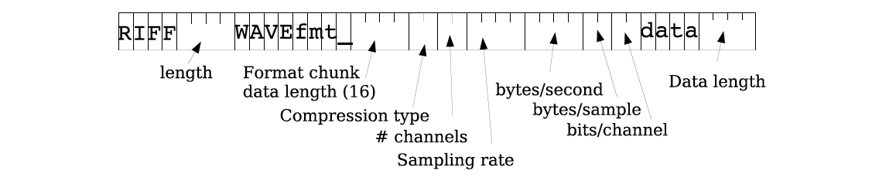
</p>


Human hearing is more sensitive to small intensities than large ones. That means we do not perceive amplitude differences linearly. Log compression uses more precision for small values and less precision for large values.

μ-law compression is one example. It is useful in telephony because it keeps quiet speech details more faithfully while accepting more error for louder parts.

### Why Log Compression Makes Sense

A linear scale wastes many numeric levels on loud ranges where humans are less sensitive. A logarithmic scale better matches perception. This idea appears again in Mel and log-Mel features: speech features often become better when they reflect human perception rather than raw physics only.

---

## 7. Pitch, Loudness, Intensity, RMS, and F0

<p align="center">
  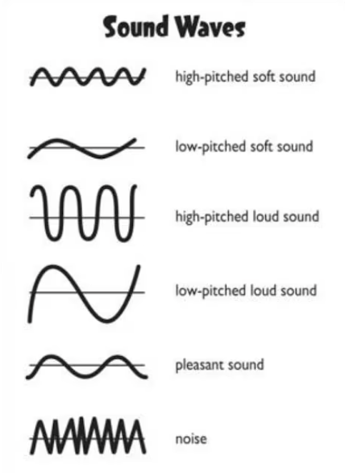
</p>
<p align="center">
  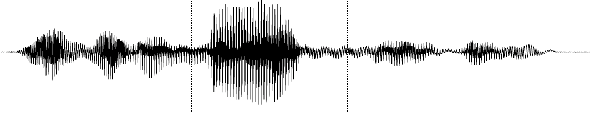
</p>
<p align="center">
  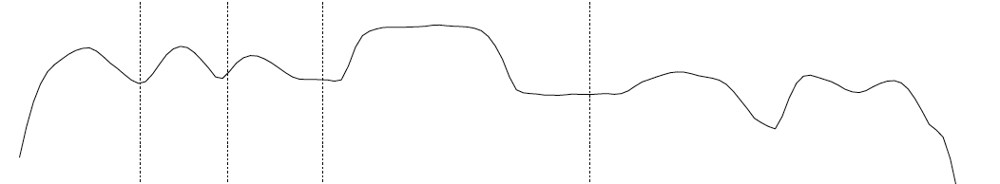
</p>


Pitch is the perceived highness or lowness of a sound. It is strongly related to frequency, but it is perceptual, not purely physical. Loudness is related to intensity, and intensity is related to amplitude squared.

```text
Intensity ∝ A²
```

This means doubling amplitude does not merely double intensity; it increases intensity by a factor of four.

> **DEFINITION — Pitch**  
> Pitch is the perceived frequency of a sound: how high or low it seems.

> **DEFINITION — Loudness**  
> Loudness is the perceived strength of sound, related to intensity and measured using decibel-like scales.

> **DEFINITION — RMS Amplitude**  
> RMS summarizes average signal energy over a frame:  
> `RMS = √((1/n) · ∑ a_t²)`

> **DEFINITION — F0**  
> F0, or fundamental frequency, is the lowest frequency of a periodic waveform. It is strongly related to perceived pitch.

### Mini Example: RMS

Suppose a tiny frame has amplitudes:

```text
a = [1, -1, 2, -2]
```

Then:

```text
square values: [1, 1, 4, 4]
mean square = (1 + 1 + 4 + 4) / 4 = 10 / 4 = 2.5
RMS = √2.5 ≈ 1.58
```

RMS is useful because negative and positive amplitudes do not cancel; squaring measures energy-like magnitude.

---

## 8. Hearing Range and Why Hz Alone Is Not Enough

<p align="center">
  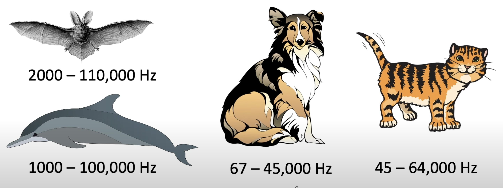
</p>


Humans can roughly hear between `20 Hz` and `20 kHz`, but perception is not linear. A difference of 500 Hz at low frequencies can sound huge, while a difference of 2000 Hz at high frequencies may not feel as dramatic.

This is the motivation for Mel. Human hearing is more sensitive at low frequencies, and low-frequency information such as formants is very important for distinguishing vowels and nasals.

### The Core Problem With Hz

Hz is physically correct, but perceptually uneven. If we use equal spacing in Hz, the system may waste too much detail in high frequencies and not enough detail in low frequencies.

> **EXAM TRAP**  
> Mel is not used because Hz is “wrong.” Hz is physically valid. Mel is used because ASR benefits from a representation closer to human pitch perception.

---

## 9. Frequency Spectrum, Frequency Bands, Formants, and Spectrograms

<p align="center">
  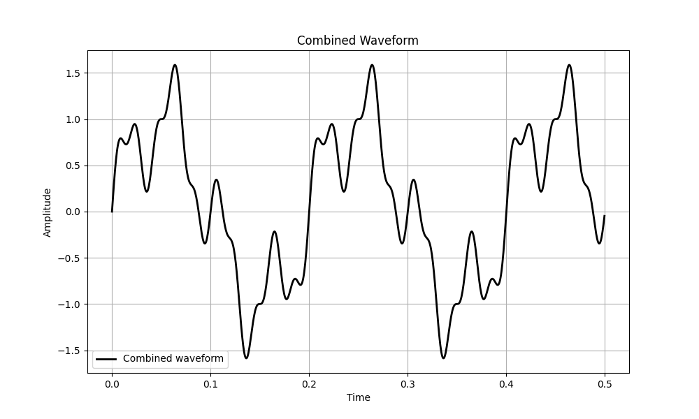
</p>
<p align="center">
  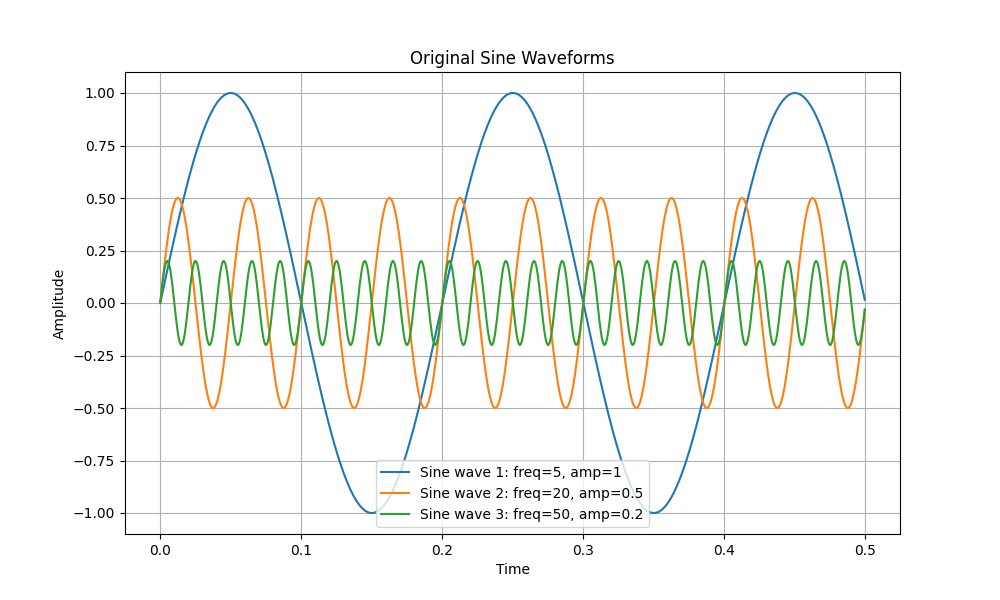
</p>
<p align="center">
  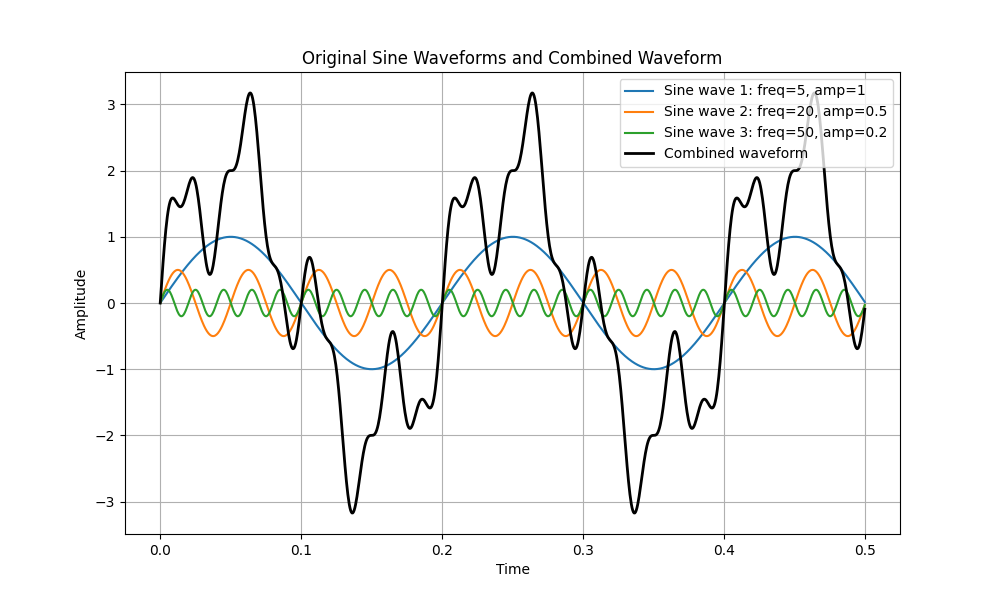
</p>
<p align="center">
  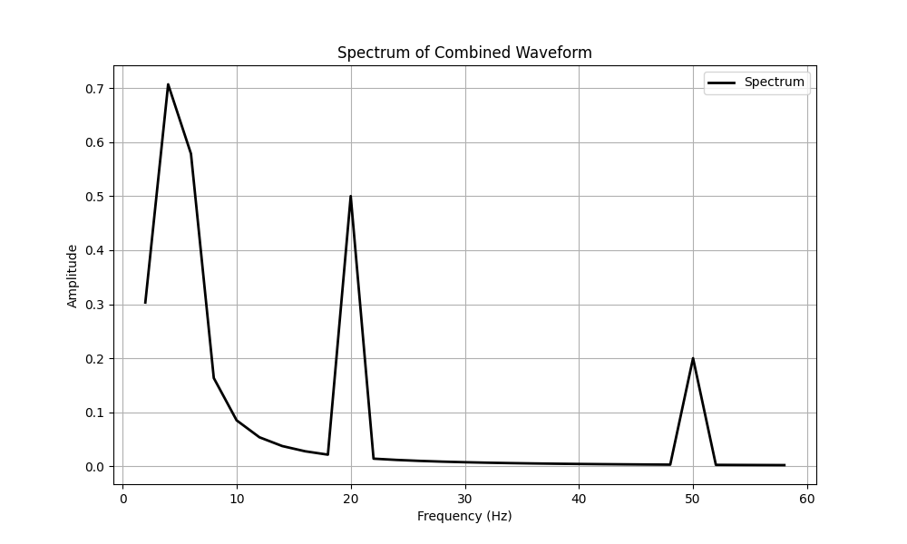
</p>
<p align="center">
  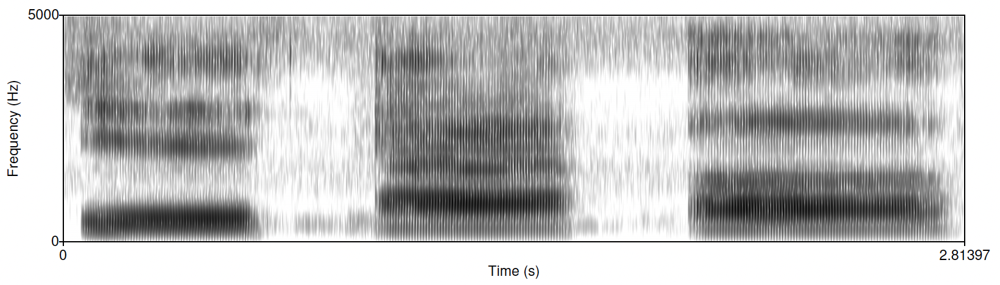
</p>
<p align="center">
  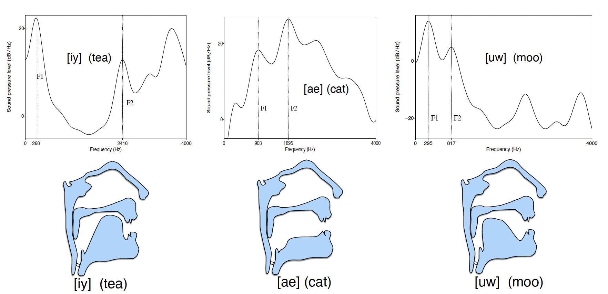
</p>
<p align="center">
  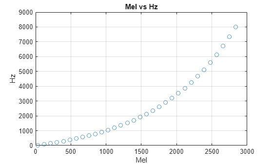
</p>


A frequency spectrum shows frequency versus amplitude. It tells us which sinusoidal components exist in the signal. It is obtained using Fourier analysis, commonly the Discrete Fourier Transform for digital signals.

A spectrogram extends this idea over time. It shows time on one axis, frequency on another axis, and amplitude/intensity using color or darkness.

> **DEFINITION — Frequency Spectrum**  
> A representation showing how much energy or amplitude exists at each frequency.

> **DEFINITION — Spectrogram**  
> A time-frequency representation showing how the spectrum changes over time.

> **DEFINITION — Formant**  
> A formant is an amplified frequency band caused by the resonant shape of the vocal tract. Formants are especially important for vowel identity.

### Why Frequency Bands Matter

Phones have characteristic spectral signatures. A vowel is not recognized only by its amplitude in the waveform; it is recognized by its frequency structure, especially formants. This is why speech systems extract spectral features instead of feeding raw waveform amplitude directly into older GMM-HMM pipelines.

---

## Connections from Lecture 1

Lecture 1 gives the raw material: sound, waveform, sampling, frequency, spectrum, and perceptual hearing issues. Lecture 2 takes the frequency spectrum and transforms it into the Mel spectrum, which is more aligned with human perception. Without Lecture 1, Mel would feel like a random formula. With Lecture 1, Mel becomes a direct response to the problem: **Hz spacing does not match how humans hear speech.**

---

# Lecture 2 — From Frequency Spectrum to Mel Spectrum and MFCC

## Big Picture

Lecture 2 explains how we move from a raw frequency spectrum to a Mel-based representation. This is one of the most important feature extraction ideas in classical speech recognition. The lecture focuses on Mel Spectrum and MFCC, with the main pipeline being: split speech into frames, compute frequency spectrum, apply Mel filter banks, compute log energies, and optionally apply DCT to produce MFCCs.

The exam risk here is that students memorize the Mel formula but fail to understand the pipeline. The formula alone is not the method. The method is a sequence of transformations designed to convert raw signal information into perceptually meaningful features.

---

## 1. Recap: Waveform, Spectrum, Spectrogram, Mel

Lecture 2 begins from the Lecture 1 idea that a waveform can be decomposed into many sinusoidal waves. The frequency spectrum shows which frequencies are active and how strong they are. The spectrogram shows this over time.

Mel then modifies the frequency scale so that equal distances on the Mel scale roughly correspond to equal perceived pitch differences.

### Why This Is Needed

A speech recognizer does not need every raw detail of the waveform. It needs a compact representation that preserves phonetic information. Mel features do exactly this: they compress frequency information in a perceptually sensible way.

---

## 2. Mel Scale

<p align="center">
  
</p>


The Mel scale is designed to match human perception of pitch. Equal intervals in Mel correspond more closely to equal perceived pitch distances.

A standard conversion is:

```text
mel(f) = 2595 · log₁₀(1 + f/700)
```

The inverse is:

```text
f = 700 · (10^(mel/2595) − 1)
```

The lecture states that 1000 Hz is anchored at approximately 1000 mels, and below around 500 Hz, Mel and Hz are roughly similar.

### Mini Example: Convert 1000 Hz to Mel

```text
mel(1000) = 2595 · log₁₀(1 + 1000/700)
          = 2595 · log₁₀(1 + 1.4286)
          = 2595 · log₁₀(2.4286)
          ≈ 2595 · 0.3856
          ≈ 1000.6 mels
```

So 1000 Hz is about 1000 Mel.

> **EXAM TRAP**  
> If the formula uses `log₁₀`, do not use natural log unless the formula is rewritten with a different constant. Using the wrong log base gives the wrong answer.

---

## 3. Frequency Spectrum to Mel Spectrum: The Full Pipeline

<p align="center">
  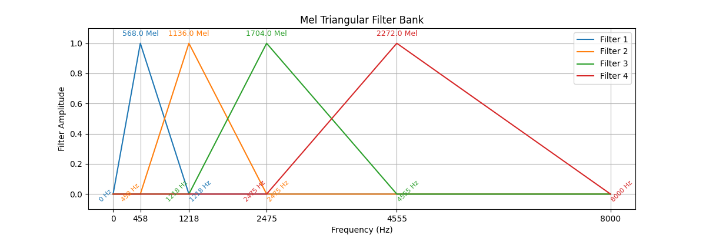
</p>
<p align="center">
  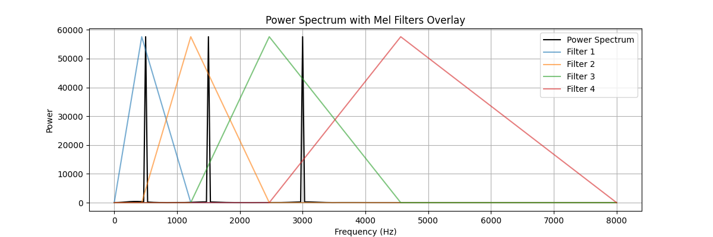
</p>
<p align="center">
  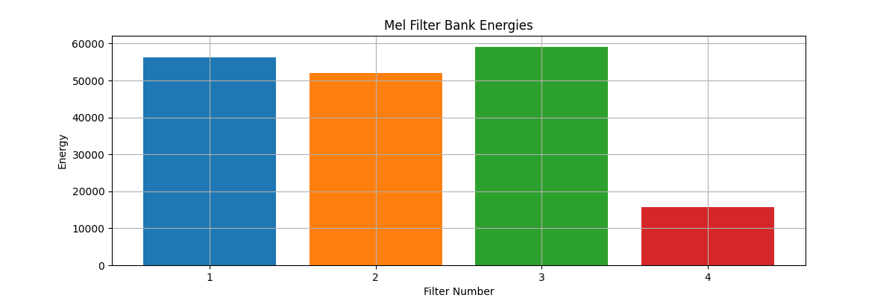
</p>


The lecture’s main idea is the mapping from frequency spectrum to Mel spectrum. The pipeline is:

```text
1. Take a short frame of audio.
2. Compute its frequency spectrum using DFT/FFT.
3. Convert lower and upper frequency limits to Mel.
4. Create equally spaced points on the Mel scale.
5. Convert those Mel points back to Hz.
6. Convert Hz positions to FFT bin indices.
7. Build triangular filters centered at those positions.
8. Overlay the triangular filters on the spectrum.
9. Multiply each filter by the spectrum and sum energy inside that band.
10. Take log energy for each band.
11. The output vector is the Mel spectrum for that frame.
```

The important thing: a Mel filter bank does not keep every frequency bin separately. It groups nearby frequencies into perceptual bands.

> **DEFINITION — Mel Filter Bank**  
> A set of triangular filters placed along the frequency axis using Mel-spaced centers. Each filter measures energy in one perceptual frequency band.

> **DEFINITION — Mel Spectrum**  
> A vector of energies produced by applying Mel filter banks to the frequency spectrum of a frame.

### Why Triangular Filters?

Triangular filters create smooth overlap between neighboring bands. A frequency near the center of a filter contributes strongly to that band. A frequency near the edge contributes weakly. Because filters overlap, energy can contribute to adjacent bands, which avoids harsh discontinuities.

### Mini Example: One Simplified Filter Output

Suppose a triangular filter has weights:

```text
h = [0, 0.5, 1.0, 0.5, 0]
```

and the corresponding power spectrum values are:

```text
P = [2, 4, 10, 6, 2]
```

The filter output is:

```text
E = 0·2 + 0.5·4 + 1.0·10 + 0.5·6 + 0·2
  = 0 + 2 + 10 + 3 + 0
  = 15
```

If we take log energy:

```text
log(E) = log(15)
```

This value becomes one component of the Mel spectrum vector.

---

## 4. What MFCC Adds

MFCC stands for Mel-Frequency Cepstral Coefficients. The lecture mentions MFCC as a major feature type. The usual MFCC pipeline continues after log Mel energies by applying DCT.

```text
waveform frame
→ FFT / power spectrum
→ Mel filter bank energies
→ log energies
→ DCT
→ MFCC vector
```

### Why Apply DCT?

The log Mel filter outputs are often correlated. DCT decorrelates and compresses them into coefficients. The lower-order MFCC coefficients capture broad spectral envelope shape, which is useful for speech recognition.

### Important Distinction

Mel spectrum and MFCC are related but not identical.

- Mel spectrum = filter-bank log energies.
- MFCC = DCT-transformed version of log Mel energies.

> **EXAM TRAP**  
> Do not call every Mel-based feature “MFCC.” MFCC requires the cepstral coefficient step, usually DCT after log Mel filter-bank energies.

---

## 5. What Happens If Parameters Change?

### Too Few Mel Filters

If there are too few filters, the representation becomes too coarse. Important formant differences may be merged, making different vowels harder to distinguish.

### Too Many Mel Filters

If there are too many filters, the representation may preserve unnecessary detail, increase dimensionality, and become more sensitive to noise.

### No Log Step

Without log compression, large energies dominate and small but perceptually meaningful details may be ignored. The log step also better matches loudness perception.

### Wrong Sampling Rate Assumption

If the sampling rate is wrong, the mapping from FFT bins to Hz becomes wrong, and the Mel filters will be placed over incorrect frequencies.

---

## Connections from Lecture 2

Lecture 2 converts the raw frequency information from Lecture 1 into Mel features. Lecture 3 then moves from feature extraction to probability modeling. Once each speech frame is represented by a feature vector, we need a model for how those feature vectors are distributed. This is where Gaussian distributions and GMMs enter.

---

# Lecture 3 — Motivation for Gaussian Mixture Models

## Big Picture

Lecture 3 introduces the motivation behind Gaussian Mixture Models using simple distribution examples such as GPA distributions. The central point is that real data may not come from one simple bell-shaped distribution. It may contain multiple subpopulations, each with its own mean and variance. In speech, acoustic feature vectors often vary because of different phones, speakers, accents, noise conditions, and contexts. A single Gaussian is often too limited, while a mixture of Gaussians can represent more complex shapes.

---

## 1. Single Gaussian Distribution

<p align="center">
  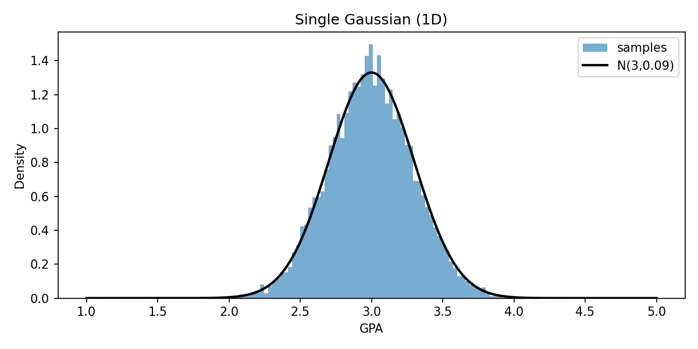
</p>


A Gaussian distribution models data clustered around a mean with spread controlled by variance.

For one-dimensional data:

```text
p(x) = N(x | μ, σ²)
```

The mean `μ` controls the center. The variance `σ²` controls the spread.

### GPA Example

If GPAs in a population are roughly centered around 3.0 with moderate spread, a single Gaussian might be acceptable. But if the population is actually made of two groups — for example, one centered around 2.3 and another around 3.6 — one Gaussian will blur the distinction.

> **DEFINITION — Univariate Gaussian**  
> A Gaussian distribution over one variable, described by a mean and variance.

---

## 2. Why One Gaussian Can Fail

A single Gaussian assumes one central peak. But many datasets have multiple peaks. If you force a single Gaussian on multi-cluster data, the mean may land between clusters where there are few actual data points.

This is not a small technical issue. It changes interpretation. If the data has two real groups and you fit one Gaussian, your model says the “middle” is most representative even if the middle is not common.

### Mini Example

Suppose student GPAs come from two groups:

```text
Group 1: mean 2.2
Group 2: mean 3.7
```

A single Gaussian might place the mean around:

```text
(2.2 + 3.7) / 2 = 2.95
```

But 2.95 may not represent either group well.

---

## 3. Mixture of Two Distributions

<p align="center">
  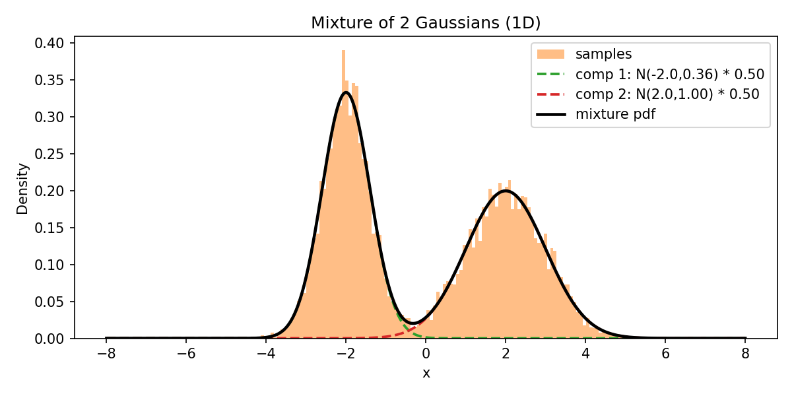
</p>
<p align="center">
  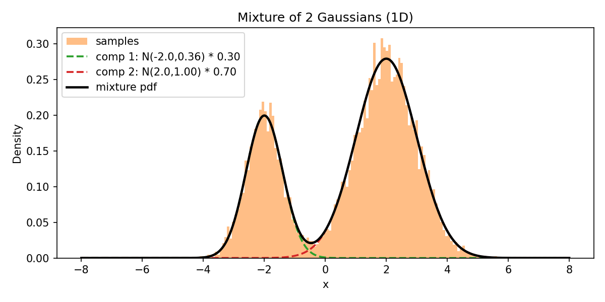
</p>


Instead of one Gaussian, use two Gaussian components. Each component models one part of the data. But the lecture emphasizes an important correction: it should be a **weighted** sum.

```text
p(x) = π₁ · N₁(x | μ₁, σ₁²) + π₂ · N₂(x | μ₂, σ₂²)
```

where:

```text
π₁ + π₂ = 1
π₁ ≥ 0, π₂ ≥ 0
```

### What the Weights Mean

The weights represent how common each component is. If `π₁ = 0.3` and `π₂ = 0.7`, then component 2 explains more of the data distribution.

> **EXAM TRAP**  
> A mixture is not simply `N₁ + N₂`. It must be a weighted sum with weights that sum to 1. Otherwise it is not a valid probability density.

---

## 4. Mixture of Three Distributions

<p align="center">
  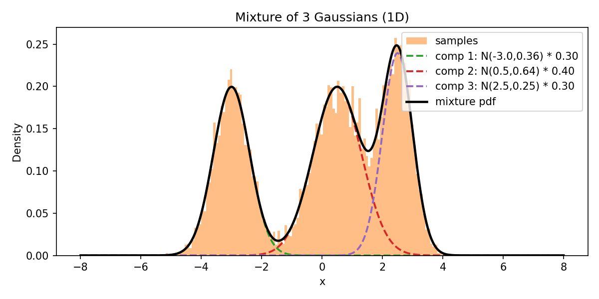
</p>


The same idea extends to more components:

```text
p(x) = π₁N₁(x) + π₂N₂(x) + π₃N₃(x)
```

where:

```text
π₁ + π₂ + π₃ = 1
```

The lecture’s intuition is that a mixture can approximate complicated shapes using simple Gaussian building blocks.

### Why This Matters in Speech

Speech acoustic features are rarely one clean blob. A phone can be pronounced differently depending on speaker, neighboring phones, stress, speed, noise, microphone, and accent. A GMM can assign different components to different acoustic variants.

---

## 5. Univariate vs Multivariate Gaussian

A univariate Gaussian models one variable. A multivariate Gaussian models a vector.

Speech features are usually vectors, not scalars. For example, an MFCC frame might have 13 coefficients, or 39 with delta and delta-delta features. Therefore, multivariate Gaussians are more relevant for speech recognition.

> **DEFINITION — Multivariate Gaussian**  
> A Gaussian distribution over a vector `x`, described by a mean vector `μ` and covariance matrix `Σ`.

### Mean Vector

The mean vector contains one mean per feature dimension.

Example:

```text
μ = [μ₁, μ₂, μ₃]
```

for a 3-dimensional feature vector.

### Covariance Matrix

The covariance matrix describes spread and correlation among dimensions.

- Diagonal entries = variance of each dimension.
- Off-diagonal entries = covariance between dimensions.

A full covariance matrix captures feature correlations. A diagonal covariance matrix assumes feature dimensions are independent given the component.

---

## 6. Multivariate Mixture

<p align="center">
  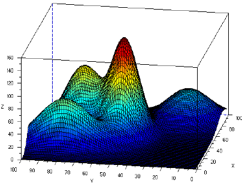
</p>


A mixture of multivariate Gaussians models vector-valued data using multiple Gaussian components.

```text
p(x) = ∑ₖ π_k · N(x | μ_k, Σ_k)
```

Each component has:

- a weight `π_k`,
- a mean vector `μ_k`,
- a covariance matrix `Σ_k`.

### Why This Is More Powerful

A single multivariate Gaussian can model one elliptical cloud. A mixture can model several clouds. Together, they can approximate complex feature distributions.

---

## Connections from Lecture 3

Lecture 3 explains why mixtures are needed. Lecture 4 formalizes this as the Gaussian Mixture Model. Lecture 5 then asks the hard question: **how do we learn the weights, means, and covariances from data when we do not know which component generated each point?** That question leads to responsibilities and EM.

---

# Lecture 4 — Gaussian Mixture Models

## Big Picture

Lecture 4 defines the Gaussian Mixture Model formally and clarifies the modeling choices behind it. The lecture distinguishes between one Gaussian per class, one multivariate Gaussian per class, mixtures of univariate distributions, and mixtures of multivariate distributions. This distinction matters because the chosen model determines what shapes of data the system can represent.

---

## 1. What Is a GMM?

<p align="center">
  
</p>
<p align="center">
  
</p>


A Gaussian Mixture Model is a weighted sum of Gaussian components used to model complex continuous distributions.

```text
p(x) = ∑ₖ₌₁ᴷ π_k · N(x | μ_k, Σ_k)
```

with constraints:

```text
∑ₖ₌₁ᴷ π_k = 1
π_k ≥ 0
```

Each component has:

- `π_k`: mixture weight,
- `μ_k`: mean,
- `Σ_k`: covariance.

> **DEFINITION — GMM**  
> A Gaussian Mixture Model represents a probability density as a weighted sum of K Gaussian components.

### Intuition

Imagine a dataset shaped like three clusters. Instead of forcing one blob to cover all of them, a GMM uses three smaller blobs. The final probability density is the sum of those blobs, weighted by how important each component is.

---

## 2. The Role of the Mixture Weight π_k

The mixture weight tells us how much component `k` contributes to the overall distribution. If `π_k` is large, the component explains a large portion of the data. If it is small, the component explains a small portion.

### Mini Example

Suppose:

```text
π₁ = 0.2
π₂ = 0.5
π₃ = 0.3
```

Then component 2 is expected to explain about 50% of the distribution, while components 1 and 3 explain about 20% and 30%.

The weights must sum to one:

```text
0.2 + 0.5 + 0.3 = 1.0
```

If they sum to 1.4 or 0.7, the model is not a valid probability distribution.

---

## 3. One Class, One Gaussian vs One Class, Many Gaussians

The lecture emphasizes several modeling options:

### Option A: One Univariate Gaussian per Class

Each class is modeled using one scalar Gaussian. This is extremely limited because it only handles one feature and one peak.

### Option B: One Multivariate Gaussian per Class

Each class is modeled as one vector Gaussian. This is better because it handles multiple features, but it still assumes one elliptical cluster.

### Option C: Mixture of Univariate Gaussians per Class

Each class has multiple scalar Gaussian components. This handles multiple peaks in one dimension but ignores feature interactions.

### Option D: Mixture of Multivariate Gaussians per Class

Each class has multiple vector Gaussian components. This is the most expressive among these classical options and is the one most relevant to acoustic feature modeling.

> **EXAM TRAP**  
> “Multivariate” and “mixture” are different concepts. Multivariate means the input is a vector. Mixture means multiple components are combined. You can have multivariate without mixture, and mixture without multivariate.

---

## 4. Choosing the Number of Mixtures K

Each class might have a different number of mixtures. Choosing `K` is a model selection problem.

### If K Is Too Small

The model underfits. It cannot represent the true complexity of the data. Different acoustic patterns are forced into the same component.

### If K Is Too Large

The model may overfit. Components may specialize on tiny groups of points. Covariance matrices can become singular if a component collapses onto too few samples.

### Practical Selection

Lecture 5 mentions cross-validation, AIC, and BIC. The key is to balance fit quality with model complexity.

---

## 5. GMM as a Soft Clustering Model

A GMM can be viewed as soft clustering. A point does not belong completely to one cluster. Instead, it has probabilities of belonging to each component. These probabilities are called responsibilities in Lecture 5.

Example:

```text
xₙ responsibility vector = [0.05, 0.90, 0.05]
```

This means component 2 is most responsible for the point, but the assignment is not hard.

### Why Soft Assignment Helps

Speech data is ambiguous. A frame may lie between acoustic patterns. Soft assignment preserves uncertainty instead of forcing early hard decisions.

---

## Connections from Lecture 4

Lecture 4 defines the GMM. Lecture 5 explains how to estimate its parameters. The missing variable is the component identity: we see `x`, but we do not directly observe which Gaussian generated it. This hidden assignment problem is exactly why EM is needed.

---

# Lecture 5 — GMM Parameter Estimation, EM, GMMs in ASR, and HMM Foundations

## Big Picture

Lecture 5 is one of the most important lectures in the course. It has two major halves. The first half explains how to learn GMM parameters using responsibilities and the EM algorithm. The second half introduces Hidden Markov Models, which add temporal sequence modeling to acoustic modeling. If Lecture 4 answers “what is a GMM?”, Lecture 5 answers “how do we train it?” and “how does it connect to speech recognition over time?”

Do not study this lecture as separate formulas. The real logic is:

```text
Unknown component assignments
→ responsibilities estimate soft assignments
→ M-step updates parameters using those soft assignments
→ repeat until likelihood stops improving
→ use GMMs to score acoustic features
→ use HMMs to model time/state sequences
```

---

## Part A — GMM Parameter Estimation

## 1. The Parameter Estimation Problem

A GMM density is:

```text
p(x) = ∑ₖ π_k · N(x | μ_k, Σ_k)
```

The parameters are:

```text
θ = {π_k, μ_k, Σ_k for k = 1,...,K}
```

The problem is that we observe the data points `xₙ`, but we do not know which component generated each point. If the component labels were known, estimation would be easier. Since they are hidden, we need an iterative method.

> **DEFINITION — Hidden Component Assignment**  
> The unknown choice of which Gaussian component generated a particular data point.

---

## 2. Responsibilities: Soft Assignments

<p align="center">
  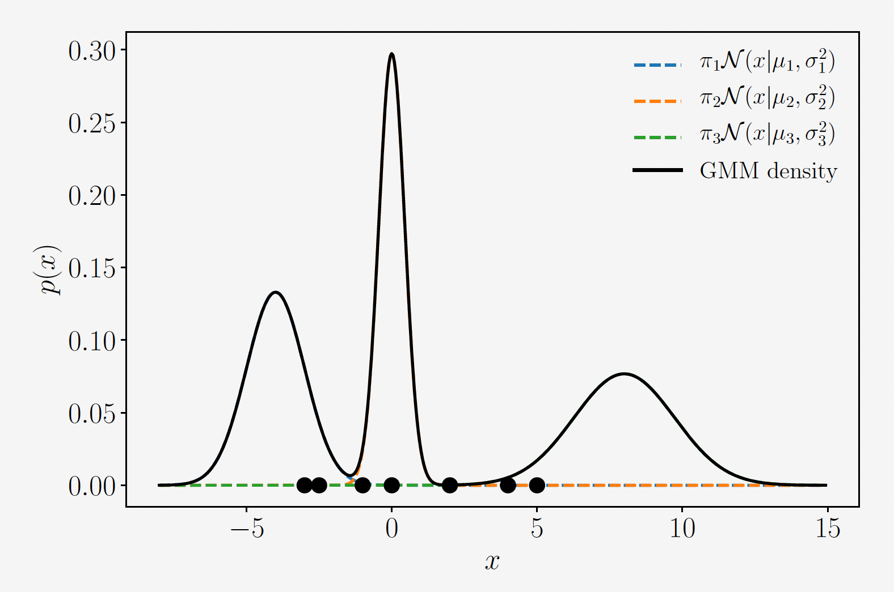
</p>
<p align="center">
  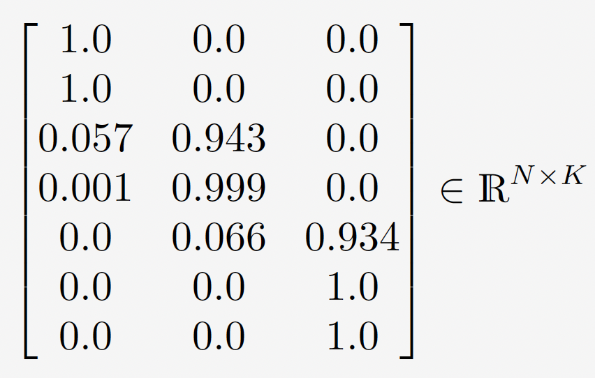
</p>


The responsibility `r_nk` is the probability that component `k` generated point `xₙ` under the current parameters.

```text
r_nk = [π_k · N(xₙ | μ_k, Σ_k)] / [∑ⱼ π_j · N(xₙ | μ_j, Σ_j)]
```

Intuition:

```text
responsibility = component k's weighted likelihood / total weighted likelihood from all components
```

If component `k` gives a high density to `xₙ` and has a high mixture weight, it gets a high responsibility.

> **Important notation correction:**  
> The effective membership count for component k should be:  
> `N_k = ∑ₙ r_nk`  
> not `∑ₖ r_nk`. The sum over components for one point equals 1, but the sum over data points gives the effective number of points assigned to component k.

### Mini Example: Responsibilities

Suppose a data point has the following weighted likelihoods:

```text
component 1: π₁N₁(x) = 0.12
component 2: π₂N₂(x) = 0.03
component 3: π₃N₃(x) = 0.05
```

Total:

```text
0.12 + 0.03 + 0.05 = 0.20
```

Responsibilities:

```text
r_n1 = 0.12 / 0.20 = 0.60
r_n2 = 0.03 / 0.20 = 0.15
r_n3 = 0.05 / 0.20 = 0.25
```

Check:

```text
0.60 + 0.15 + 0.25 = 1.00
```

So component 1 is most responsible for this point.

> **EXAM TRAP**  
> Responsibilities are normalized across components for the same data point. For fixed `n`, `∑ₖ r_nk = 1`.

---

## 3. Maximum Likelihood and Log-Likelihood

For independent data points:

```text
p(X | θ) = ∏ₙ p(xₙ | θ)
```

The log-likelihood is:

```text
L(θ) = ∑ₙ log p(xₙ | θ)
```

For GMM:

```text
L(θ) = ∑ₙ log(∑ₖ π_k · N(xₙ | μ_k, Σ_k))
```

### Why Use Log?

Products of many probabilities become extremely small. Logs convert products into sums, making computation more stable and derivatives easier.

### Why Optimization Is Hard

The log contains a sum over components:

```text
log(∑ₖ π_k · N(...))
```

This prevents a simple direct closed-form solution for all parameters at once. EM solves this by alternating between estimating hidden assignments and updating parameters.

---

## 4. EM Algorithm: The Main Idea

Expectation-Maximization alternates two steps:

```text
E-step: estimate responsibilities using current parameters.
M-step: update parameters using the current responsibilities.
```

Then repeat.

> **DEFINITION — EM Algorithm**  
> An iterative method for maximum-likelihood estimation when there are hidden variables, such as unknown mixture component assignments.

### EM Pipeline

```text
1. Initialize π_k, μ_k, Σ_k.
2. E-step: compute r_nk for every data point and component.
3. Compute N_k = ∑ₙ r_nk.
4. M-step: update π_k, μ_k, and Σ_k.
5. Compute log-likelihood.
6. Stop if improvement is small; otherwise repeat.
```

---

## 5. M-Step Updates

After responsibilities are computed, the parameters are updated as:

```text
N_k = ∑ₙ r_nk
π_k = N_k / N
μ_k = (1/N_k) · ∑ₙ r_nk xₙ
Σ_k = (1/N_k) · ∑ₙ r_nk (xₙ − μ_k)(xₙ − μ_k)ᵀ
```

### Intuition for π_k

`π_k` becomes the fraction of total responsibility assigned to component `k`.

Example:

```text
N = 100
N_k = 25
π_k = 25 / 100 = 0.25
```

### Intuition for μ_k

The mean is a weighted average of data points, where responsibilities are weights. Points strongly assigned to component `k` influence `μ_k` more.

### Mini Example: Updating μ_k

Suppose one-dimensional data:

```text
x = [2, 4, 10]
r_k = [0.8, 0.6, 0.1]
```

Then:

```text
N_k = 0.8 + 0.6 + 0.1 = 1.5
weighted sum = 0.8·2 + 0.6·4 + 0.1·10
             = 1.6 + 2.4 + 1.0
             = 5.0
μ_k = 5.0 / 1.5 = 3.333
```

The point 10 barely affects the mean because its responsibility is only 0.1.

---

## 6. Derivation Logic for π_k and λ

The weights must satisfy:

```text
∑ₖ π_k = 1
```

To enforce this constraint, the derivation uses a Lagrange multiplier `λ`:

```text
L = ∑ₙ log p(xₙ | θ) + λ(∑ₖ π_k − 1)
```

Taking derivative with respect to `π_j`, setting it to zero, and using the responsibility form gives:

```text
π_j = −N_j / λ
```

Using the constraint:

```text
∑ⱼ π_j = 1
∑ⱼ (−N_j / λ) = 1
−(∑ⱼ N_j) / λ = 1
−N / λ = 1
λ = −N
```

Therefore:

```text
π_j = N_j / N
```

### What You Should Understand

The derivation is not just symbolic manipulation. It proves that the new mixture weight equals the effective fraction of data assigned to that component.

---

## 7. Practical Considerations

### Choosing K

Choose the number of mixture components using cross-validation, AIC, or BIC. BIC has the form:

```text
BIC = −2 log L + p log N
```

where `p` is the number of parameters and `N` is the number of samples. BIC penalizes overly complex models.

### Initialization

K-means initialization is often used because EM is sensitive to starting points. Bad initialization can lead to poor local optima.

### Regularization

Covariance matrices can become singular if a component collapses onto too few points. A common fix is to add a small value to the diagonal:

```text
Σ_k ← Σ_k + εI
```

### Covariance Choices

- Full covariance: flexible but expensive.
- Diagonal covariance: cheaper and common in older ASR systems.
- Tied covariance: shared covariance across components.

> **EXAM TRAP**  
> EM does not guarantee the global optimum. It usually improves likelihood each iteration, but it can converge to a local optimum.

---

## 8. GMMs in Speech Recognition

In speech recognition, GMMs can model the probability of acoustic features given a class, state, speaker, or phoneme-related unit.

The general recognition idea is:

```text
Given feature vectors X, choose the class/model with highest likelihood p(X | class).
```

For frame-level modeling, a GMM can estimate how likely an acoustic feature vector is under a particular speech state.

### Why GMM Alone Is Not Enough

Speech is sequential. A GMM can score a frame, but it does not naturally model legal temporal progressions like phoneme order. That is why HMMs are introduced.

---

## Part B — Hidden Markov Models

## 9. Motivation for HMMs

<p align="center">
  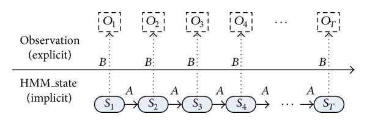
</p>


The source is the actual phonemes or words being spoken. The observed signal is the acoustic measurement recorded by the microphone. The problem is that the source is hidden: we do not directly observe phonemes; we observe noisy features.

An HMM models this using hidden states and observed emissions.

> **DEFINITION — HMM**  
> A Hidden Markov Model is a double stochastic model: one stochastic process governs hidden states, and another stochastic process generates observations from those states.

### Speech Interpretation

```text
hidden state: phoneme-like state, word state, or subphone state
observation: acoustic feature vector such as MFCC
```

---

## 10. Observable Markov Model vs HMM

In an observable Markov model, the states are directly observed. In an HMM, the states are hidden, and each hidden state emits observations.

### Observable Markov Model

```text
observed state sequence: S1 → S2 → S3
```

You can directly see the state sequence.

### HMM

```text
hidden state sequence: q₁ → q₂ → q₃
observations:          o₁   o₂   o₃
```

You see observations, not hidden states.

> **EXAM TRAP**  
> In HMM, `O` is observed and `Q` is hidden. Do not reverse them.

---

## 11. Elements of an HMM

<p align="center">
  
</p>


An HMM is usually written as:

```text
λ = (A, B, π)
```

where:

- `S`: set of hidden states,
- `O`: observation sequence or observation symbols,
- `A = {a_ij}`: transition probabilities,
- `B = {b_j(o_t)}`: emission probabilities,
- `π = {π_i}`: initial state distribution.

### Meaning of Each Parameter

`π_i` tells us the probability of starting in state `i`.

`a_ij` tells us the probability of moving from state `i` to state `j`.

`b_j(o_t)` tells us the probability that state `j` emits observation `o_t`.

---

## 12. The Three Fundamental HMM Problems

### Evaluation

Given model `λ` and observation sequence `O`, compute:

```text
p(O | λ)
```

This answers: how likely is the observed audio under this model?

### Decoding

Given `λ` and `O`, find the most likely hidden state sequence:

```text
argmax_Q p(Q | O, λ)
```

This is solved by Viterbi in Lecture 7.

### Learning

Given observations, learn model parameters:

```text
argmax_λ p(O | λ)
```

This is handled by Baum-Welch at a high level, an EM-like algorithm for HMMs.

---

## Connections from Lecture 5

Lecture 5 connects two worlds. GMMs explain how to model distributions of acoustic frames. HMMs explain how to model sequences over time. In older ASR, GMMs often model emission probabilities, while HMMs model transitions between hidden speech states. Lecture 6 focuses on the HMM evaluation problem, and Lecture 7 focuses on decoding.

---

# Lecture 6 — HMM Evaluation and the Forward Algorithm

## Big Picture

Lecture 6 solves the HMM evaluation problem: compute the probability that a model generated an observation sequence. The naïve method sums over every possible hidden state sequence, but this explodes exponentially. The Forward algorithm solves the same problem efficiently by reusing partial computations through induction. This lecture is exam-critical because it tests whether you understand the difference between summing over all paths and choosing one path.

---

## 1. Evaluation Problem Definition

Given:

```text
O = (o₁, o₂, ..., o_T)
λ = (A, B, π)
```

Compute:

```text
P(O | λ)
```

This is the probability that HMM `λ` produces the observation sequence `O`.

### Why It Matters

If each word has a separate HMM, we can score an input audio sequence under each word model. The recognized word may be the model with the highest likelihood.

---

## 2. Direct Computation

<p align="center">
  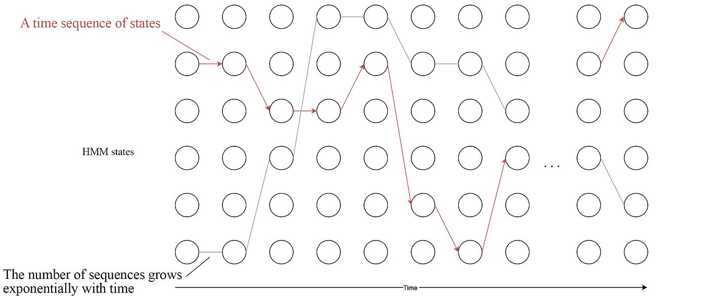
</p>


The observation sequence could have been generated by any hidden state sequence:

```text
Q = (q₁, q₂, ..., q_T)
```

So:

```text
P(O | λ) = ∑ over all Q P(O, Q | λ)
```

For one path `Q`, the joint probability is:

```text
P(O, Q | λ) = π_q1 · b_q1(o₁) · a_q1q2 · b_q2(o₂) · ... · a_q(T−1)qT · b_qT(o_T)
```

### Why Direct Computation Is Infeasible

If there are `N` states and `T` time steps, there are:

```text
N^T
```

possible hidden sequences.

### Mini Example

If `N = 5` and `T = 100`, then the number of paths is:

```text
5^100
```

This is astronomically large. Direct enumeration is impossible.

> **EXAM TRAP**  
> Direct computation is not bad because one path is expensive. It is bad because the number of paths is exponential.

---

## 3. The Forward Variable α

The Forward algorithm defines:

```text
α_t(i) = P(o₁, o₂, ..., o_t, q_t = i | λ)
```

This means: the probability of observing the first `t` observations and being in state `i` at time `t`.

### Why This Helps

Instead of remembering every full path, `α_t(i)` summarizes all paths that end in state `i` at time `t`. This is the induction trick.

---

## 4. Forward Algorithm Initialization

At time `t = 1`:

```text
α₁(i) = π_i · b_i(o₁)
```

This means we start in state `i` with probability `π_i`, then state `i` emits the first observation with probability `b_i(o₁)`.

### Mini Example

Suppose:

```text
π₁ = 0.6, b₁(o₁) = 0.5
π₂ = 0.4, b₂(o₁) = 0.1
```

Then:

```text
α₁(1) = 0.6 · 0.5 = 0.30
α₁(2) = 0.4 · 0.1 = 0.04
```

---

## 5. Forward Induction

<p align="center">
  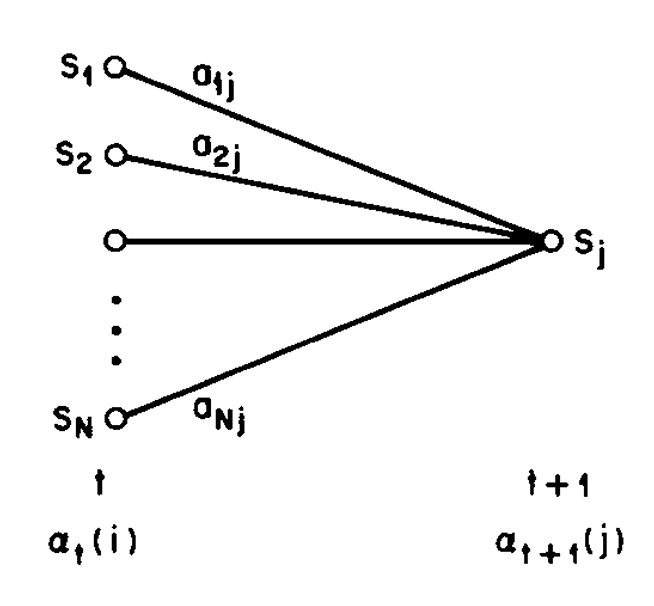
</p>


For each next state `j`:

```text
α_{t+1}(j) = [∑ᵢ α_t(i) · a_ij] · b_j(o_{t+1})
```

Interpretation:

1. Consider every previous state `i`.
2. Take the probability of reaching `i`: `α_t(i)`.
3. Multiply by transition probability from `i` to `j`: `a_ij`.
4. Sum over all possible previous states.
5. Multiply by the probability that state `j` emits the next observation.

### Mini Example: One Forward Step

Suppose at time `t`:

```text
α_t(1) = 0.30
α_t(2) = 0.04
```

Transitions into state 1:

```text
a_11 = 0.7
a_21 = 0.4
```

Emission at next time:

```text
b_1(o_{t+1}) = 0.6
```

Then:

```text
α_{t+1}(1) = [0.30·0.7 + 0.04·0.4] · 0.6
            = [0.21 + 0.016] · 0.6
            = 0.226 · 0.6
            = 0.1356
```

---

## 6. Forward Termination

At the final time `T`, sum over all possible final states:

```text
P(O | λ) = ∑ᵢ α_T(i)
```

Why sum? Because the sequence may end in any state, and all these possibilities contribute to the total likelihood.

---

## 7. Complexity

For each time step and each next state `j`, we sum over `N` previous states. That gives:

```text
O(T · N²)
```

This is much better than direct enumeration:

```text
O(T · N^T) or exponential in T
```

The Forward algorithm is efficient because it does dynamic programming: it stores reusable summaries instead of recomputing every path separately.

---

## 8. What Forward Actually Computes

Forward computes the **total probability of the observation sequence**, summing over all possible hidden paths.

It does not find the best path. That is Viterbi.

> **EXAM TRAP**  
> Forward uses `sum`. Viterbi uses `max`. This is the single most important distinction between Lecture 6 and Lecture 7.

---

## Connections from Lecture 6

Lecture 6 solves evaluation: how likely is the observation sequence under the model? Lecture 7 solves decoding: which hidden state sequence is most likely? The algorithms look similar because both use dynamic programming, but their goals are different. Forward sums over paths; Viterbi chooses the best path.

---

# Lecture 7 — HMM Decoding and the Viterbi Algorithm

<p align="center">
  
</p>


## Big Picture

Lecture 7 solves the HMM decoding problem: find the most likely sequence of hidden states that produced an observed sequence. This is different from evaluating the total likelihood. In ASR terms, decoding estimates the best phoneme/state path behind the acoustic observations. The Viterbi algorithm is a dynamic programming method that efficiently finds the best path using max operations and backpointers.

---

## 1. Decoding Problem Definition

Given:

```text
O = (o₁, o₂, ..., o_T)
λ = (A, B, π)
```

Find:

```text
best Q = (q₁, q₂, ..., q_T)
```

that maximizes the probability of the hidden path and observations.

The objective is often written conceptually as:

```text
argmax_Q P(Q | O, λ)
```

Using the model structure, Viterbi works with best joint path probabilities.

---

## 2. The Viterbi Variable δ

The lecture defines `δ_t(i)` as the highest probability among all state sequences that end in state `i` at time `t` and generate observations up to `t`.

```text
δ_t(i) = max over q₁,...,q_{t−1} P(q₁,...,q_t=i, o₁,...,o_t | λ)
```

### Intuition

Forward asks:

```text
What is the total probability of all paths ending here?
```

Viterbi asks:

```text
What is the probability of the single best path ending here?
```

---

## 3. Initialization

At time 1:

```text
δ₁(i) = π_i · b_i(o₁)
ψ₁(i) = 0
```

`ψ` stores backpointers. At time 1, there is no previous state, so the backpointer is 0 or null.

---

## 4. Recursion / Induction

For each state `j` at time `t`:

```text
δ_t(j) = maxᵢ [δ_{t−1}(i) · a_ij] · b_j(o_t)
ψ_t(j) = argmaxᵢ [δ_{t−1}(i) · a_ij]
```

Interpretation:

1. For every possible previous state `i`, take the best path probability ending at `i`.
2. Multiply by transition probability from `i` to `j`.
3. Pick the maximum previous state.
4. Multiply by emission probability of current observation from state `j`.
5. Store which previous state won in `ψ_t(j)`.

> **Careful notation note**  
> If you write the recurrence as `δ_{t+1}(j)`, the emission must be `b_j(o_{t+1})`. If you write it as `δ_t(j)`, the emission is `b_j(o_t)`. Mixing these is an off-by-one error.

---

## 5. Termination

At the final time:

```text
P* = maxᵢ δ_T(i)
q*_T = argmaxᵢ δ_T(i)
```

This gives the probability of the best path and the final state of that path.

But this is not enough. You still need the full sequence.

---

## 6. Backtracking

Viterbi stores backpointers `ψ_t(j)`. After finding the final best state, move backward:

```text
q*_T = final best state
q*_{T−1} = ψ_T(q*_T)
q*_{T−2} = ψ_{T−1}(q*_{T−1})
...
q*_1 = ψ₂(q*_2)
```

This reconstructs the best hidden state sequence.

> **EXAM TRAP**  
> If you only compute `P*` but do not backtrack, you have not solved the decoding problem. You found the best path probability, not the best path itself.

---

## 7. Mini Example: One Viterbi Step

Suppose:

```text
δ_{t−1}(1) = 0.30
δ_{t−1}(2) = 0.04
```

Transitions into state 1:

```text
a_11 = 0.7
a_21 = 0.4
```

Emission:

```text
b_1(o_t) = 0.6
```

Candidate paths:

```text
from state 1: 0.30 · 0.7 = 0.21
from state 2: 0.04 · 0.4 = 0.016
```

Choose max:

```text
max = 0.21 from state 1
```

Then:

```text
δ_t(1) = 0.21 · 0.6 = 0.126
ψ_t(1) = 1
```

Compare with Forward for the same numbers:

```text
Forward would sum: (0.21 + 0.016) · 0.6 = 0.1356
Viterbi takes max: 0.21 · 0.6 = 0.126
```

Forward is larger here because it includes both paths. Viterbi keeps only the best one.

---

## 8. Complexity

Like Forward, Viterbi considers every previous state for every next state at every time step:

```text
O(N²T)
```

The added backpointer table also requires memory, usually `O(NT)`.

---

## 9. Forward vs Viterbi

| Question | Forward | Viterbi |
|---|---|---|
| Goal | Compute total likelihood `P(O|λ)` | Find best hidden path |
| Operation | Sum over previous states | Max over previous states |
| Output | Probability of observation sequence | Best path and its probability |
| Uses backpointers? | No | Yes |
| Complexity | `O(N²T)` | `O(N²T)` |

### The Deep Difference

Forward treats all possible state paths as contributing evidence. Viterbi assumes the best path dominates and returns that path. Viterbi probability is usually lower than or equal to Forward likelihood because max is less than or equal to sum.

---

## Connections from Lecture 7

Lecture 7 completes the core HMM story started in Lecture 5. Lecture 6 answers “how likely is this observation sequence under the model?” Lecture 7 answers “which hidden state path most likely produced it?” Lecture 8 then shifts to modern neural audio compression and tokenization, which is different from classical GMM-HMM but still relies on converting speech into useful discrete or compact representations.

---

# Lecture 8 — Speech Tasks, EnCodec, Vector Quantization, and Residual VQ

## Big Picture

Lecture 8 moves from classical ASR concepts to modern neural audio compression and tokenization. It introduces speech tasks such as ASR and TTS, then focuses on EnCodec, a neural audio codec designed for high-fidelity compression at low bitrates. The important conceptual shift is that speech can be converted into discrete tokens, similar to how text is tokenized. This makes speech usable by modern generative models.

---

## 1. Speech Tasks

### ASR

Automatic Speech Recognition maps speech to text.

```text
speech waveform → text transcript
```

### TTS

Text-to-Speech maps text to speech.

```text
text → speech waveform
```

### Zero-Shot TTS

Zero-shot TTS synthesizes speech for an unseen speaker. It tries to generate a voice style without requiring a large amount of training data for that specific speaker.

---

## 2. TTS Components

The lecture mentions two major TTS components:

1. **Audio tokenizer / neural audio codec**
2. **Conditional language model**

The audio tokenizer converts speech into digitized tokens. The language model generates or predicts token sequences conditioned on text or other inputs.

### Why Tokenization Matters

Text models work with tokens. If audio can also be represented as tokens, then language-model-like architectures can model speech sequences more naturally.

---

## 3. Codec

A codec encodes analog speech signals into a digitized compressed representation and decodes that representation back into audio.

> **DEFINITION — Codec**  
> A mechanism for encoding audio into a compressed digital representation and decoding it back into audio.

The key tradeoff is:

```text
lower bitrate ↔ smaller representation
higher fidelity ↔ better reconstructed quality
```

The hard problem is achieving both low bitrate and high fidelity.

---

## 4. EnCodec Motivation

EnCodec aims for high-fidelity neural audio compression at very low bitrates.

> **DEFINITION — Bitrate**  
> The amount of data used per unit time, often measured in kbps for audio.

> **DEFINITION — High Fidelity**  
> Reconstructed audio sounds close to the original, with minimal perceptual loss.

### Why Traditional Compression Is Not Enough

At very low bitrates, traditional codecs may produce artifacts. Neural codecs try to learn compact representations that preserve perceptually important details.

---

## 5. EnCodec Architecture

<p align="center">
  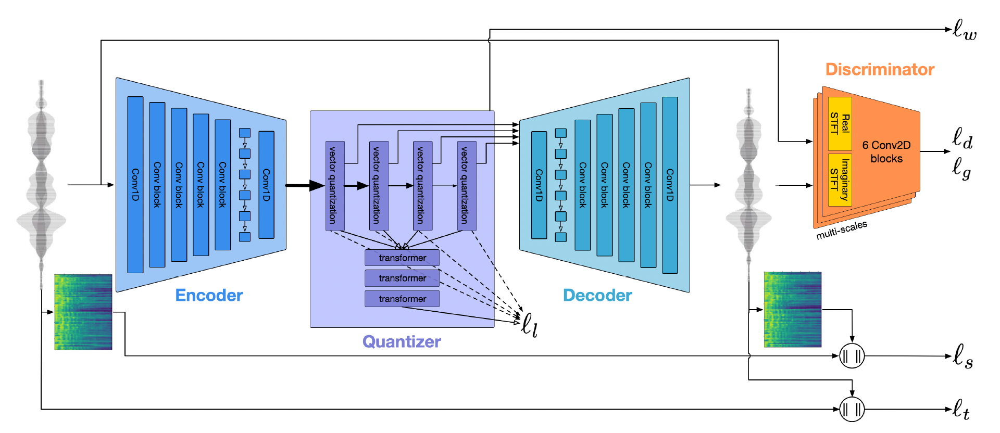
</p>


The EnCodec system has three main parts:

```text
Input audio x
→ Encoder E
→ latent representation z
→ Quantization layer Q
→ quantized representation z_q
→ Decoder G
→ reconstructed audio x_hat
```

### Encoder

<p align="center">
  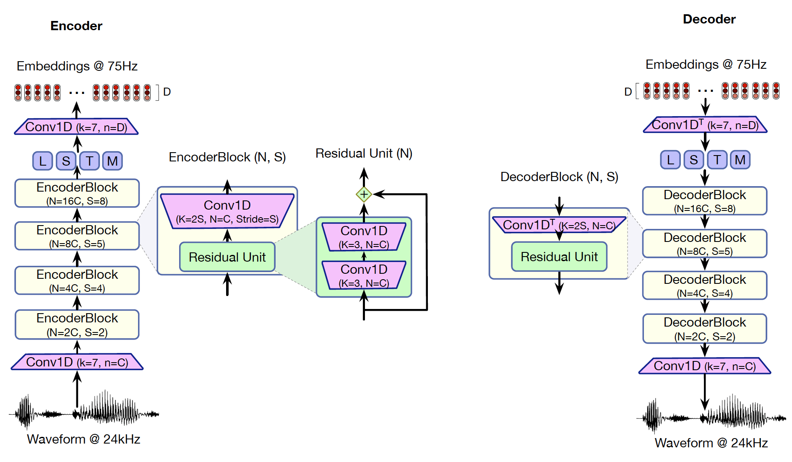
</p>


The encoder maps raw audio into a latent representation. The lecture mentions 1D convolutions, residual units, down-sampling layers, and a two-layer LSTM for sequence modeling.

### Quantization Layer

The quantization layer converts continuous latent vectors into discrete codebook entries.

### Decoder

The decoder reconstructs the time-domain signal from the quantized representation. It mirrors the encoder using transposed convolutions.

---

## 6. Vector Quantization

<p align="center">
  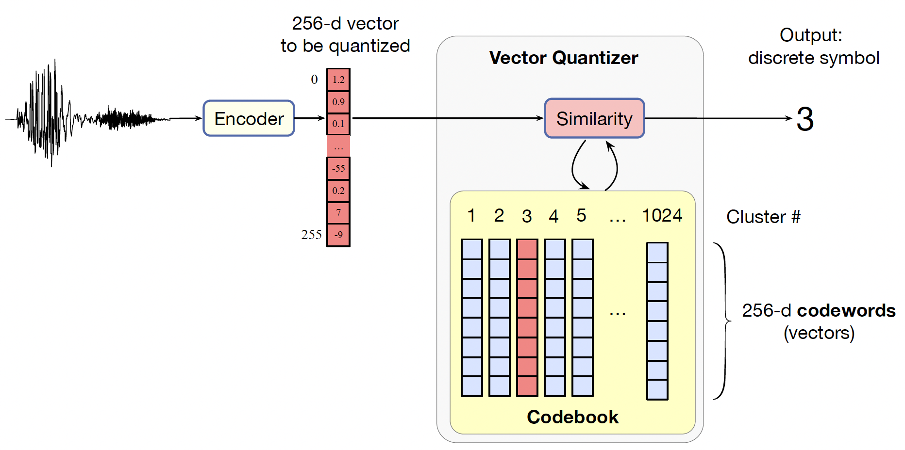
</p>


Vector Quantization maps continuous vectors to discrete codewords.

Training intuition:

```text
1. Pass many speech wavefiles through the encoder.
2. Collect latent vectors.
3. Cluster these vectors into k clusters.
4. Each cluster center becomes a codeword.
5. Replace each latent vector with the nearest codeword.
6. Feed codewords to the decoder.
```

> **DEFINITION — Codebook**  
> A set of learned representative vectors used to quantize continuous latent vectors.

> **DEFINITION — Codeword**  
> One selected vector from the codebook.

### Why VQ Helps

VQ creates discrete tokens. Instead of storing full continuous vectors, the system stores code indices. This reduces bitrate and makes the representation more token-like.

### Mini Example

Suppose a 2D latent vector is:

```text
z = [2.1, 3.9]
```

and codebook vectors are:

```text
c₁ = [0, 0]
c₂ = [2, 4]
c₃ = [5, 5]
```

The nearest codeword is `c₂`, so:

```text
Q(z) = c₂
stored token = index 2
```

---

## 7. Residual Vector Quantization

<p align="center">
  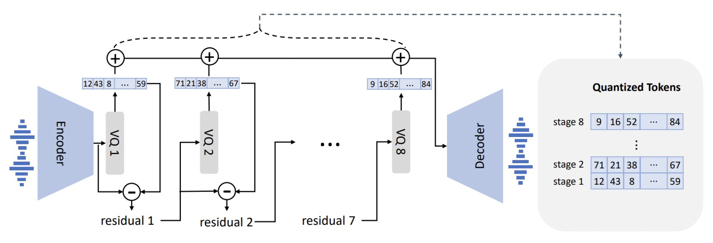
</p>


Residual Vector Quantization uses multiple quantizers in sequence. Each stage quantizes the remaining error from previous stages.

Pipeline:

```text
r₀ = z
q₁ = VQ₁(r₀)
r₁ = r₀ − q₁
q₂ = VQ₂(r₁)
r₂ = r₁ − q₂
q₃ = VQ₃(r₂)
...
z_q = q₁ + q₂ + q₃ + ...
```

The first quantizer captures the coarse approximation. Later quantizers refine the residual.

> **DEFINITION — Residual**  
> The remaining error after an approximation has been subtracted.

### Why RVQ Supports Multiple Bandwidth Targets

If you use more residual stages, reconstruction improves but bitrate increases. If you use fewer stages, bitrate decreases but reconstruction quality drops.

The lecture notes that at 24 kHz, training can support bandwidths such as:

```text
1.5, 3, 6, 12, and 24 kbps
```

This is possible by selecting a variable number of residual steps.

### Mini Example

Suppose:

```text
z = 10
q₁ = 7
r₁ = 10 − 7 = 3
q₂ = 2
r₂ = 3 − 2 = 1
q₃ = 1
r₃ = 1 − 1 = 0
```

Final reconstruction:

```text
z_q = q₁ + q₂ + q₃ = 7 + 2 + 1 = 10
```

More stages reduced the residual from 3 to 1 to 0.

---

## 8. Losses in EnCodec

<p align="center">
  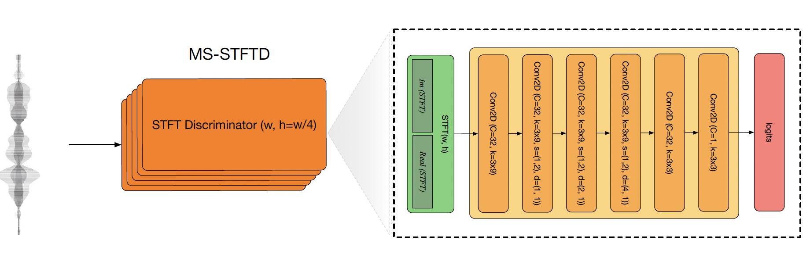
</p>


The lecture mentions several loss types:

- time-domain reconstruction loss,
- frequency-domain reconstruction loss,
- adversarial generator loss,
- adversarial discriminator loss.

### Time-Domain Loss

This compares the waveform samples directly. It encourages the reconstructed waveform to match the original waveform.

### Frequency-Domain Loss

This compares spectral content. It is important because two waveforms may look different sample-by-sample but sound similar, or vice versa. Frequency losses encourage perceptual spectral fidelity.

### Adversarial Loss

A discriminator learns to distinguish real audio from reconstructed audio. The generator/decoder learns to produce audio that fools the discriminator. This helps improve perceptual realism.

---

## 9. What Happens If…?

### Too Few Codebook Entries

The model cannot represent enough acoustic variation. Audio becomes distorted or overly smooth.

### Too Many Codebook Entries

The model may improve quality but increase storage and training complexity. Codebook usage may become inefficient if many entries are rarely used.

### Too Few RVQ Stages

The residual remains large, so reconstruction quality is poor.

### Too Many RVQ Stages

Quality may improve, but bitrate and compute cost increase.

### Weak Frequency Loss

The reconstructed waveform may match some time-domain behavior but sound unnatural because spectral structure is poor.

### Weak Adversarial Training

The audio may be numerically close but perceptually dull or artifact-heavy.

---

## Connections from Lecture 8

Lecture 8 is not a direct continuation of HMM math, but it fits the course theme: speech systems depend on useful representations. Lectures 1–2 convert waveform into spectral/Mel features. Lectures 3–7 model those features probabilistically with GMMs and HMMs. Lecture 8 shows a modern neural alternative: learn an encoder, quantizer, and decoder to convert speech into compact discrete tokens. The classical and neural approaches differ, but both ask the same core question: **how do we represent speech so that a model can reason over it?**

---

# Cross-Lecture Map — How the Eight Lectures Fit Together

## The Full Classical ASR Logic

```text
Lecture 1: Speech is a physical waveform and has linguistic structure.
Lecture 2: Convert waveform frames into perceptually meaningful spectral features.
Lecture 3: Real feature distributions are often multi-modal, motivating mixtures.
Lecture 4: GMM formalizes a weighted mixture of Gaussian components.
Lecture 5: EM learns GMM parameters; HMMs model hidden speech-state sequences.
Lecture 6: Forward computes total observation likelihood efficiently.
Lecture 7: Viterbi finds the most likely hidden state sequence.
Lecture 8: EnCodec shows a neural codec/tokenizer approach to speech representation.
```

## The One-Sentence Course Summary

Speech recognition turns waveform into features, models feature distributions, handles hidden time structure, and decodes the most likely linguistic sequence.

## The Most Dangerous Confusions

| Confusion | Correct Distinction |
|---|---|
| Letter vs phone | Letters are written symbols; phones are speech sounds. |
| Frequency vs pitch | Frequency is physical; pitch is perceptual. |
| Sampling rate vs bit depth | Sampling rate controls time/frequency capture; bit depth controls amplitude precision. |
| Spectrum vs spectrogram | Spectrum is frequency content for a frame/window; spectrogram shows frequency content over time. |
| Hz vs Mel | Hz is physical frequency; Mel approximates perceived pitch scale. |
| Mel spectrum vs MFCC | MFCC applies DCT to log Mel energies. |
| Multivariate vs mixture | Multivariate means vector-valued; mixture means multiple components. |
| Responsibility vs weight | Responsibility is data-point-specific; mixture weight is global. |
| Forward vs Viterbi | Forward sums over paths; Viterbi maximizes over paths. |
| Evaluation vs decoding | Evaluation computes `P(O|λ)`; decoding finds best hidden `Q`. |
| VQ vs RVQ | VQ uses one quantization stage; RVQ quantizes residuals over multiple stages. |

---

# Minimal Exam-Focused Recap

## L1

Know how speech sounds become waveforms and how waveforms become digital signals. Understand amplitude, frequency, period, sampling, bit depth, RMS, F0, pitch, loudness, spectrum, formants, spectrogram, and why Mel is needed.

## L2

Know the frequency-spectrum-to-Mel-spectrum pipeline. The Mel formula is important, but the filter-bank procedure is more important.

## L3

Know why one Gaussian may fail and why mixtures are needed. Understand univariate vs multivariate Gaussians.

## L4

Know the GMM density, the meaning of `π_k`, `μ_k`, and `Σ_k`, and the difference between single Gaussian and mixture models.

## L5

Know responsibilities, EM steps, parameter updates, likelihood, practical GMM issues, and the HMM elements `(A, B, π)`. This is one of the heaviest lectures.

## L6

Know why direct HMM evaluation is exponential and how Forward reduces it to `O(N²T)` by summing partial path probabilities.

## L7

Know Viterbi initialization, recursion, termination, and backtracking. Never forget backpointers.

## L8

Know ASR vs TTS, codec motivation, EnCodec architecture, VQ, RVQ, and the role of reconstruction/adversarial losses.

